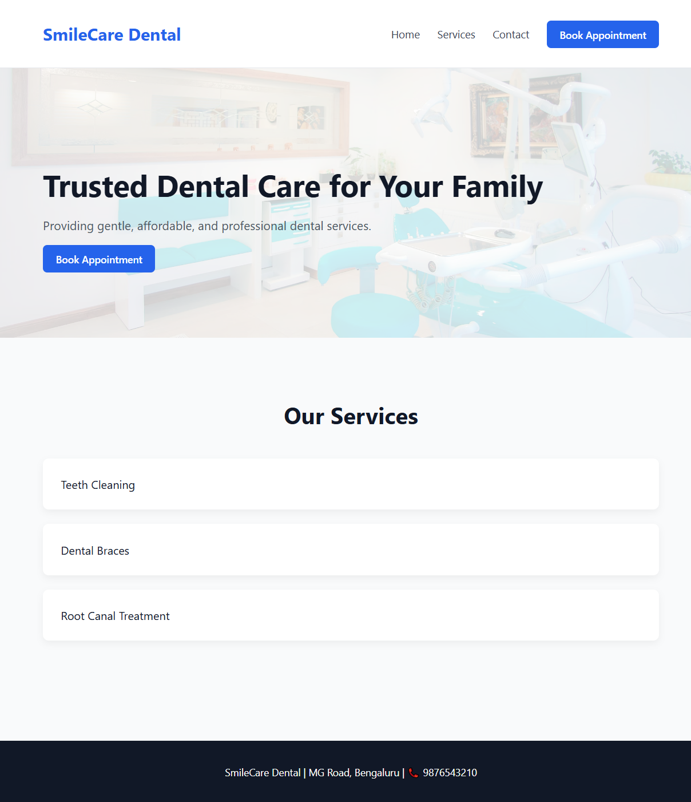
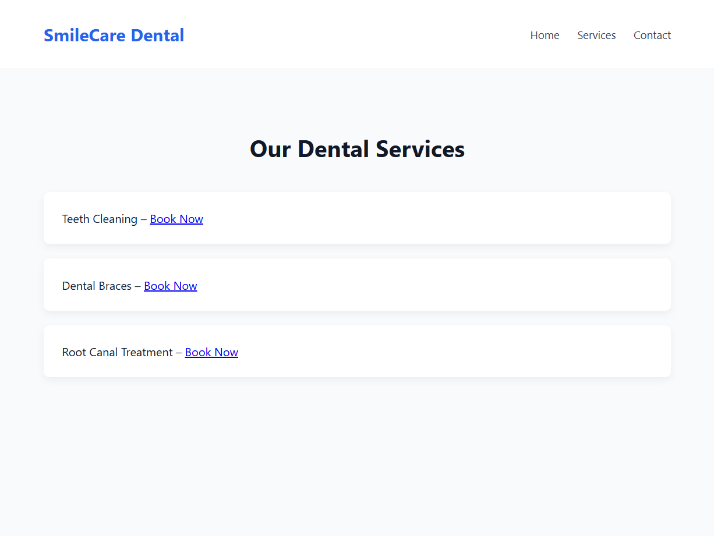
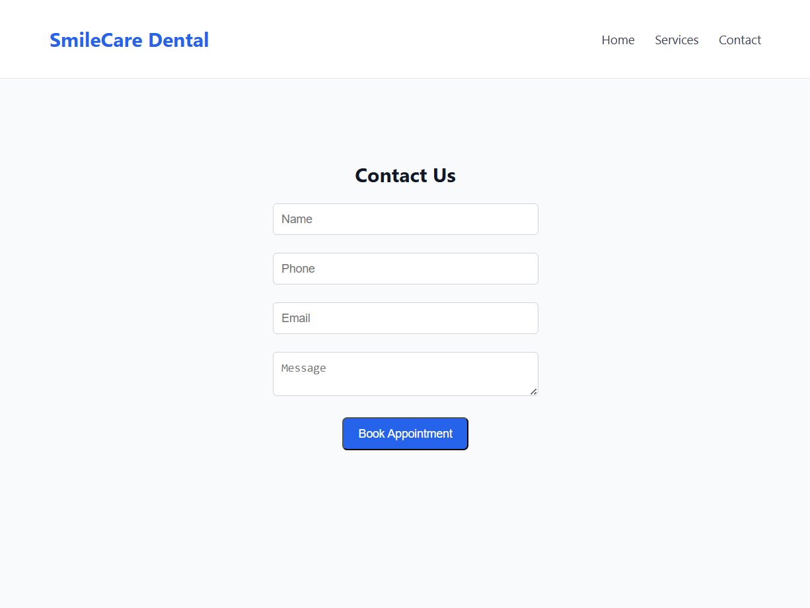

# SmileCare Dental – Local Service Website Redesign (UI/UX Task 1)

## Project Overview
This project focuses on redesigning a local dental clinic website with an emphasis on lead generation and conversion optimization.
The design aims to provide a clean, professional, and mobile-friendly user experience.

## Pages Included
- Homepage
- Services Page
- Contact / Lead Page

## Key UX & Conversion Features
- Clear value proposition and trust-focused messaging
- Prominent call-to-action buttons (Book Appointment, Contact)
- Simple and intuitive navigation
- Lead capture form on the contact page
- Mobile-responsive and user-friendly layout

## Tools & Technologies Used
- HTML & CSS (UI prototyping using VS Code)
- Google Chrome
- GitHub

## Design Rationale
The homepage highlights key messaging and primary services to quickly build trust.
Clear CTAs are placed strategically to encourage appointment bookings.
The services page helps users understand offerings clearly.
The contact page is centered and simplified to improve form completion and lead conversion.

## Screenshots

### Homepage

### Services Page

### Contact Page

## Conclusion
This project demonstrates practical UI/UX design skills applied to a real-world local service business with a focus on usability and conversions.
